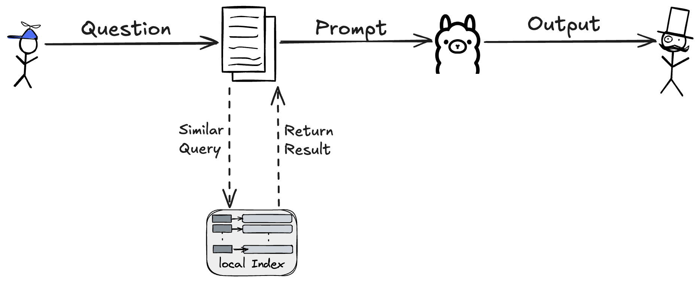

## 🔥 摘要
RAG（检索增强生成）作为AI工程化的重要技术，而AI工程化能力将成为未来前端核心竞争力，其对前端开发者具有特殊价值：

1. **能力边界突破**：通过LlamaIndex、langChain等轻量框架，前端开发者无需深度学习背景即可实现本地知识问答系统将传统UI开发延伸至智能交互领域

2. **全栈价值提升**：前端可直接管理文档加载->向量化->查询的完整AI链路，打破前后端技术壁垒（后续延伸可基于next方案）

3. **新型场景落地**：基于浏览器的本地AI能力（如项目中的Ollama集成），可开发离线智能助手、私有化知识库等场景，符合GDPR时代的数据隐私要求  

我们这篇文章仅仅只是基于js和业界已有的第三方库，搭建一个最小化的本地模型问答的rag增强mvp，旨在为大家提供一些思路和样例，希望能对大家自己心中想做的事情一点帮助。  

## 🎉 架构预览


## 🌟 效果预览
在终端中运行问答，通过自然语言提问（如"violet几岁了？他爱吃什么？"），系统能从本地知识库（knowledge1.txt）中检索并生成准确回答：

```bash
🧠 回答生成中...
🧠 回答： violet已经24岁了，喜欢吃肯德基的吮指原味鸡。
```

## 🛠️ 环境准备
1. 安装基础环境：
```bash
# Node.js（建议18+版本）
brew install node 

```

2. 本地下载ollama：https://ollama.com/download  

3. 下载NLP模型：
```bash
# 下载7B大语言模型
ollama pull deepseek-r1:7b

# 下载文本嵌入模型
ollama pull nomic-embed-text
```

## 🚀 项目初始化
1. 创建项目目录：
```bash
mkdir violet-llamaIndex-front
npm init -y
```

2. 安装核心依赖：
```bash
npm install llamaindex @llamaindex/ollama @llamaindex/readers
```

## 📂 核心代码解析
### 1. 问答入口（src/index.js）
<mcsymbol name="index.js" filename="index.js" path="/Users/chenhebin/Documents/violet/code/ai/llamaIndex/violet-llamaIndex-front/src/index.js" startline="1" type="function"></mcsymbol>
```javascript
import { storeVectors } from './ragHook/useVectorIndex.js'
import { queryVectors } from './ragHook/useQueryEngine.js'

// 创建向量索引（只需要首次运行执行，这边demo直接运行）
await storeVectors()

// 执行自然语言问答
await queryVectors('violet几岁了？他爱吃什么？')
```

### 2. 配置管理（ollama.config.js）
```javascript
// ollama的配置信息
export const OLLAMA_CONFIG = {
    BASE_URL: "http://localhost:11434", // 本地Ollama服务地址
    // 本地Ollama服务 -【LLM模型】
    LLM: {
        model: "deepseek-r1:7b",
        temperature: 0.5, // 可选参数控制生成随机性
        requestTimeout: 30000 // 超时设置（毫秒）
    },
    // 本地Ollama服务 -【嵌入模型】
    EMBEDDING: {
        model: "nomic-embed-text",
        embeddingDimensions: 768 // 必须与模型实际维度匹配
    }
};

// 本地向量存储的配置信息
export const STORAGE_CONFIG = {
    PERSIST_DIR: "storage/ragTest"
};

// RAG知识库的配置信息
export const RAG_KNOWLEDGE_CONFIG = {
    KNOWLEDGE_PATH: "ragKnowledge"
}
```

## 🧩 实现细节
### 文档向量化流程
```javascript
// 先初始化全局设置
Settings.embedModel = initializeEmbedding()

/**
 * 从本地目录中加载文档并创建向量索引储存在特定的位置
 * 注意：这里的queryEngine是一个异步函数，需要等待返回结果后才能继续执行后续代码
 * 可以使用async/await或者.then()来处理返回的Promise对象
 */
export async function storeVectors() {
    // 创建向量存储索引
    const storageContext = await getStorageContext()
    // 从目录中加载文档并设置元数据
    const documents = await getDocuments()

    // 从文档中创建向量索引
    await VectorStoreIndex.fromDocuments(documents, {
        serviceContext: {
            embedModel: Settings.embedModel // 使用全局设置的嵌入模型（本地ollama模型）
        },
        storageContext
    })
    console.log('-----索引创建完成-----');
}
```

### 向量索引构建
```javascript
// 初始化全局设置 - llamaindex底层会自动使用Settings.llm和Settings.embedModel的配置，不用手动注入
Settings.llm = initializeLLM();
Settings.embedModel = initializeEmbedding();

/**
 * 从本地向量库中查询并生成回答
 * 注意：这里的queryEngine是一个异步函数，需要等待返回结果后才能继续执行后续代码
 * 可以使用async/await或者.then()来处理返回的Promise对象
 * @param {*} question 
 * @returns 
 */
export async function queryVectors(question) {
    // 基于已经完成持久化的目录，创建向量存储索引-【storageContextFromDefaults方法】
    const storageContext = await getStorageContext();
    // 基于向量存储索引，初始化创建查询引擎
    const index = await VectorStoreIndex.init({ storageContext });
    // 创建查询引擎
    const queryEngine = index.asQueryEngine();

    console.log("🧠 回答生成中...");
    // 发起查询，可以使用流式处理【stram: true】，但是需要额外处理流式数据
    const response = await queryEngine.query({ query: question });
    console.log("🧠 回答：", response.toString());
    return response;
}

```

## 🔍 常见问题排查
1. 服务启动失败检查：
```bash
# 确认Ollama服务状态
lsof -i :11434

# 检查模型下载状态
ollama list

# 检查模型运行情况
ollama ps
```

2. 索引构建问题：
```bash
# 查看存储目录结构
ls -l storage/ragTest/
```

## 📚 学习资源
- LlamaIndex官方文档：https://ts.llamaindex.ai/
- Ollama模型库：https://ollama.com/library

希望这份教程能帮助大家快速搭建本地知识问答demo，如有其他实现细节需要展开讲解，欢迎在评论区交流讨论~